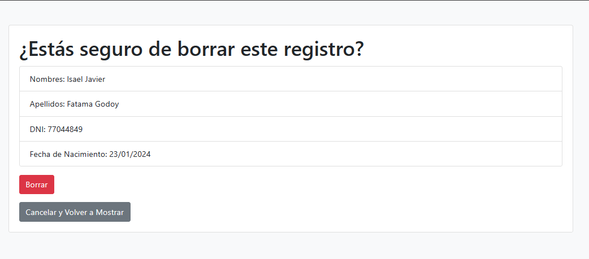

# CRUD BÁSICO EN HTML

Elaboración de un crud básico en html, css y js.

## Features  

- Crear (CREATE)
- Leer (READ)
- Actualizar (UPDATE)
- Eliminar (DELETE)

## Screenshots  

## Tech Stack  

**Client:** Html, Css, Boostrap  

**Server:** Node, Express

## Elaborarlo en local

Clonar el repositorio

~~~bash  
  git clone https://link-to-project
~~~

Entrar a la carpeta del repositorio

~~~bash  
  cd my-project
~~~

Instalar las dependencias  

~~~bash  
npm install
~~~

Iniciar el servidor

~~~bash  
npm run start
~~~

## License  

[MIT](https://choosealicense.com/licenses/mit/)
